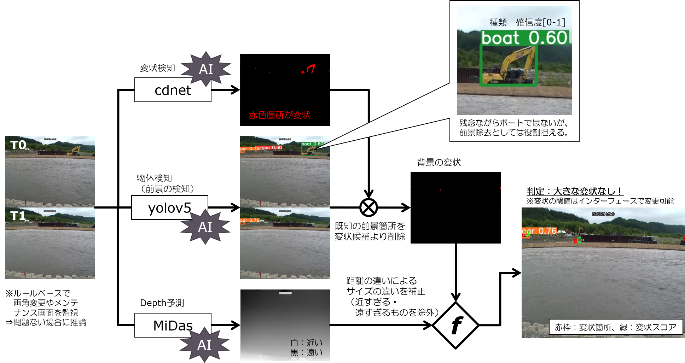
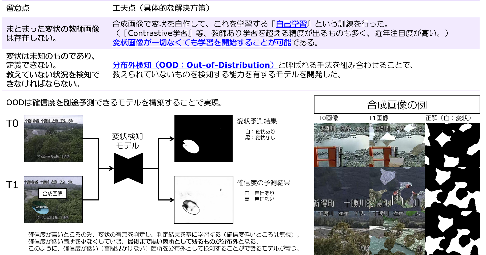

# cdnet2022
Change Detection Neural Network [2022]

以下の三つのモデルの連携で河岸侵食を検知  
- 既知の前景をYolov5（https://github.com/ultralytics/yolov5
）で除去  
- 変化を検出する教師なし変状検知モデル「cdnet」で変状箇所を検出  
- Depth予測モデル（MiDaS；https://github.com/isl-org/MiDaS
）で検知結果の大きさを評価  

変状検知モデルはランダムに生成される合成画像で変状を自己学習する構成です。  

  

## チュートリアル
レポジトリをクローンします。

    git clone https://github.com/coldriv/cdnet2022.git  

weightsファイルをダウンロードして一つ階層の上の場所にフォルダごと置いてください。  
Gドライブに保存しています。
[こちら](https://drive.google.com/drive/folders/1ImNeaXaMnB4tZDzrpohfshCgVxkO38gc?usp=sharing/)
。

    python 0.main.py

## 独自の画像を推論
「0.main.py」の実行部分は以下の通りです。ファイルのパスを適宜記述しなおしてください。

    m = predictor(device="cuda",
                  weight_cdnet="../weights/model.pth",
                  weight_yolo5="../weights/yolov5x6.pt",
                  weight_depth="../weights/depth.pt")

    allrun(m,
           p0s = ["../_tmp/20210726145000.jpg",
                  "../_tmp/20210726150001.jpg",
                  "../_tmp/20210726151002.jpg",
                  "../_tmp/20210726152002.jpg"],
           p1  =  "../_tmp/20210726153001.jpg",
           pm  =  "mask/mask_004.jpg")
